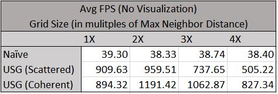

**University of Pennsylvania, CIS 565: GPU Programming and Architecture,
Project 1 - Flocking**

* John Marcao
  * [LinkedIn](https://www.linkedin.com/in/jmarcao/)
* Tested on: Windows 10, i5-4690K @ 3.50GHz, 8GB DDR3, RTX 2080 TI 3071MB (Personal)

# Boids - Writing Efficient CUDA Code

## Overview

This project covered parallel algorithms, CUDA kernel programming, kernel debugging, and performance analysis. 

| 5,000 Boids | 50,000 Boids | 200,000 Boids |
| ------------- | ----------- | ----------- |
|   |  |  |

This project runs a simple simulation of bird-like Boids that follow a few simple rules for movement. The rules are sumarized as **seperation**, **alignment**, and **cohesion**.

* Separation - Boids wat to fly away from other nearby boids.
* Cohesion - Boids want to fly towards the center of mass of nearby boids.
* Alignment - Boids want to fly in the same direction as other nearby boids.

Each of these rules are given a weight and applied to each boid based on its neighbors. The effects of nearby boids can be modified through two parameters for each rule: distance and scale. In this implementation, each rule has an absolute distance where the rule will apply. Also, the effects of each rule scale based on a weight value. Although helpful in understanding the simulation, these values will not be tested.

The focus of this project is to implement three variations of a Boids simulation.

* Naive - Each boid looks at all other boids in the simulation space and applies each rule to each boid.
* Uniform Spatial Grid (USG) - Each boid looks at other boids located in neighboring cells. This reduces the search space for each boid by elimnating boids that would be ignored due to the distance rules.
* Uniform Spatial Grid (USG) with Coherent Memory - Boids behave the same as in a Uniform Grid, but data is rearranged by the GPU prior to the Boid looking at it. This allows memory accesses to be localized.

Beyond this point the abstract Boids start to fail and we move to more concrete terms. Below is an example of a Spatial Grid containing some boids. A naive implementation will have each boid (each thread executing on a GPU) check each other boid in memory. This leads to a lot of wasted memory access. For example, Boid 4 will read the position of Boid 6 and then decide that the boid is too far for any rules to apply. The time spent reaching out to memory to get information on Boid 6 is wasted.

We introduce an additional step to have boids only inspect other boids in neighboring cells. The neighborhood is defined by maximum distance that any of the boid's rules apply. This can be seen in the picture below. Boid 9 will only read information about Boids 0, 1, and 4. Boid 4 is still outside the range of any rules, but this is still a great improvement over analyzing all boids.

To access memory on a cell-basis, we can set up multiple arrays of sorted pointers and leverage the parallel execution of a GPU to quickly sort our data. We first look at each boid and calculate which cell it is in and store this information in an array. We then sort the array on the cell index. We then walk over the sorted array and store the begining and ending indices for each cell. This will allow a boid to detemine its own cell and then find the pointers to each of its neighbors by insepcting the start and stop indicies for each cell.

This can be further imroved by sorting position and velocity data for each boid to line up with the same indicies used in the Grid cell array. This allows us to eliminate one more memory read from each thread while also keeping all boid data coherent. This gives some major performance improvements that we will explore in the next section.

## Performance Analysis

To get a deeper understaining of CUDA programming, I ran several performance tests over a variety of settings and options. Some of the results are obvious, while some take a bit more understanding of GPU architecture to fully understand. Data was collected using the CUDA Event API.

First, I modified the number of boids simulated by each algorithm. This is the most straightforward and obvious test. By increasing the number of boids, we increase the number of threads that must be executed and the ammount of data each thread has to read. We can see here that the coherent memory access has a huge benefit as we move up to 500,000 boids. The USG (Scattered) implementation spends most of its time waiting for memory reads from global memory. By using coherent data, we allow the GPU to optimize memory accesses.

| | |
| ------------- | ----------- |
|  |  |

Next I modified the block size with each algorithm. I also ran this test under 5,000 and 50,000 boid simulations to better understand it. Looking at the data, it seems like block sizes up to 256 have a neglible, if minor, effect on performance. This is a change to how the GPU processess the data. These results tell me that, at least up to a blocksize of 256, there is no bottleneck in the way the GPU is organizing threads.

| | |
| ------------- | ----------- |
|  |  |

Lastly, I looked at the effects of increasing the grid size used by each algorithm. By modifying the grid size, we can add more or less cells to the search space of each boid. Looking at the collected data, using a grid size of 2 times the maximum search space provides the best performance. Going below or above that value has performance penalties. When using a smaller grid size, each boid must inspect more grids. Since the grid data is located coherently, checking within a grid is cheap. However, checking between grids carries a penalty. Conversely, by increasing the cell width to 3 or 4 times the Max Rule Distance, more data is stored coherently but also more boids must be checked. Any boid not included in the 2X rule will be ultimately ignored because it will fall outside the Max Rule Distance. A grid size of 2X the Max Rule Distance is ideal because a boid will never have to inspect a cell it has no chance of finding a neighbor in.

| | |
| ------------- | ----------- |
|  |  |

## Questions

**For each implementation, how does changing the number of boids affect performance? Why do you think this is?**

Increasing the number of boids reduces performance for each implementation, although the effects are greater for the Naive implementation. When using a naive search, each boid must be checked, so adding any number of boids increases the ammount of work each thread has to do. Adding more boids to the USG implementations has a smaller effect when jumping from 5,000 to 10,000 boids. This is because each thread has a much smaller search space and adding 5,000 additional boids spread randomly through the simulation space doesn't cause a noticeable performance loss. However, when moving up to 50,000 and above boids, a larger loss is measured. At those levels, the Coherent USG imeplementation performs better. Since boids are located together in memory, the GPU can optimize any accesses.

**For each implementation, how does changing the block count and block size affect performance? Why do you think this is?**

I did not see a big effect from modifying the block count and size. This makes me think that the bottleneck in performance is unrelated to the block count. Reduciong block sizes further can cause poor resource utilization on the GPU.

**For the coherent uniform grid: did you experience any performance improvements with the more coherent uniform grid? Was this the outcome you expected? Why or why not?**

Yes, as can be seen from the above performance data, having coherent data gave a big boost to performance, especially at high boid counts. When data is located nearby, the GPU can perform more efficient memory reads. Also, since the algorithm is using the dev_coherent_pos array, indexes are nearby and therefore warps will be accessing similar data. The GPU can perform one large read and reuse data stored in the SM local memory.

**Did changing cell width and checking 27 vs 8 neighboring cells affect performance? Why or why not?**
From the analysis section above:

> By modifying the grid size, we can add more or less cells to the search space of each boid. Looking at the collected data, using a grid size of 2 times the maximum search space provides the best performance. Going below or above that value has performance penalties. When using a smaller grid size, each boid has to inspect more grids. Since the grid data is located coherently, checking within a grid is cheap. However, checking between grids carries a penalty. Conversely, by increasing the cell width to 3 or 4 times the Max Rule Distance, more data is stored coherently but also more boids have to be checked. Any boid not included in the 2X rule will be ultimately ignored because it will fall outside the Max Rule Distance. A grid size of 2X the Max Rule Distance is ideal because a boid will never have to inspect a cell it has no chance of finding a neighbor in.

